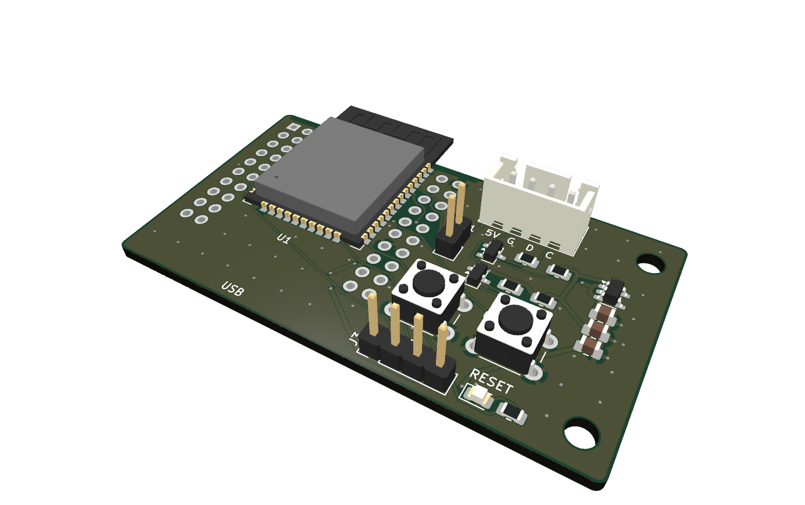
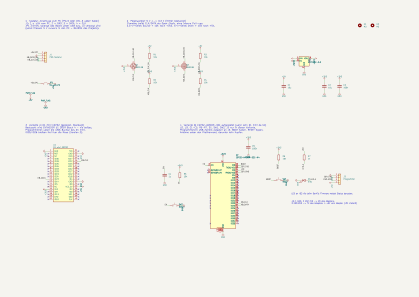
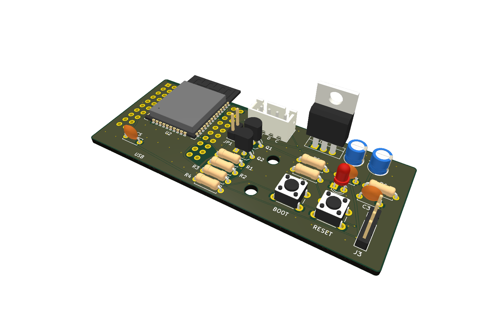

# Hardware: carrier boards for esp32-bt2ps2

> ⚠️ **Untested.** These boards have been designed and checked (KiCad ERC/DRC clean), but **no board has been
> manufactured or tested yet**. Use at your own risk and check everything with a multimeter before connecting
> it to a computer. Feedback welcome.
>
> ⚠️ **Noch nicht getestet.** Die Platinen sind entworfen und geprüft (ERC/DRC ohne Befund), aber **noch nicht
> gefertigt und nicht erprobt.**

Two boards for the firmware in this repository — **keyboard only (version 1)**, same pins as the firmware
defaults (`KB_CLK_PIN = 22`, `KB_DATA_PIN = 23`), so the firmware runs unchanged.

| | [SMD](bt2ps2-smd) | [THT](bt2ps2-tht) |
|---|---|---|
| ESP32 | **A:** D1 mini ESP32 plugged in, **or B:** ESP32-WROOM-32E soldered on | same |
| Level shifter 5 V ↔ 3.3 V | 2 × BSS138 (SOT-23) + 10 kΩ | 2 × 2N7000 (TO-92) + 10 kΩ |
| 3.3 V regulator (variant B only) | AP2112K-3.3 | LD1117V33 (TO-220) |
| Passives | 0805 | through-hole (the WROOM is the only SMD part) |
| Size | 61.0 × 34.1 mm | 83.0 × 34.1 mm |

Both are 2-layer boards made for JLCPCB's standard process (1.6 mm, 1 oz, HASL). Designed with **KiCad 10**.

**Downloads:** Gerber ZIPs, KiCad projects and schematics are attached to the
[release v0.1](https://github.com/sfambach/esp32-bt2ps2/releases/tag/v0.1).

## SMD board

## THT board

## Enclosures

3D-printable cases for both boards (shell + lid, OpenSCAD source and STLs) are in [`case/`](case/README.md).

## What is on the board

- **J1 – keyboard connector to the PC** (JST-XH, 4 pins): `1 = +5V`, `2 = GND`, `3 = DATA`, `4 = CLK` (printed as
  `5V G D C`). Crimp a cable to a PS/2 (Mini-DIN-6) or AT (DIN-5) plug:

  | J1 | PS/2 Mini-DIN-6 pin | AT DIN-5 pin |
  |---|---|---|
  | 1 +5V | 4 | 5 |
  | 2 GND | 3 | 4 |
  | 3 DATA | 1 | 2 |
  | 4 CLK | 5 | 1 |

  Pinouts as commonly documented — **measure your plug before use.**
- **JP1 – 5 V from the PC.** Pull the jumper while the board is powered over USB (or J3), otherwise 5 V is fed back
  into the PC's keyboard port — the same warning as in the main README.
- **Variant A (default):** a *D1 mini ESP32* (MH-ET LIVE MiniKit / "D1 mini ESP32 ESP-WROOM-32", 4 rows of pins,
  39 × 32 mm) on female headers. Programming via its own USB port. Its USB end is flush with the board edge,
  its antenna overhangs the opposite edge.
- **Variant B:** an ESP32-WROOM-32E soldered between the inner header rows, antenna over the board edge. Adds the
  3.3 V regulator, EN/BOOT circuitry, **BOOT** and **RESET** buttons, a status LED on IO2 and **J3** for a
  USB-serial adapter: `1 GND`, `2 ESP TXD → adapter RX`, `3 ESP RXD → adapter TX`, `4 +5V`.
  Populate **either A or B**, never both.
- IO25/IO26 are kept free for the mouse port (planned for version 2).

## Files per board

| File | |
|---|---|
| `*.kicad_pro`, `*.kicad_sch`, `*.kicad_pcb` | KiCad 10 project |
| `*.kicad_dru` | design rules for JLCPCB |
| `*.kicad_sym`, `*.pretty/` | symbol and footprint of the D1 mini ESP32 socket |
| `*-schaltplan.pdf` / `.svg` | schematic |
| `fertigung/*-jlcpcb-gerber.zip` | Gerber + drill files, ready to upload to JLCPCB |
| `fertigung/bestueckung-*.pdf` | assembly drawings |
| `fertigung/*-ibom.html` | interactive BOM (open in a browser) |
| `fertigung/stueckliste.csv` | bill of materials |

## Notes and open points

- **2N7000 at 3.3 V gate (THT board):** Vgs(th) is typically 2.1 V but may be up to 3 V. It should work for the
  low PS/2 currents — try it on a breadboard first. A BS170 is *not* a drop-in replacement (different pinout).
- The D1 mini footprint is based on [r0oland/ESP32_mini_KiCad_Library](https://github.com/r0oland/ESP32_mini_KiCad_Library)
  and was checked against the pinout of an actual board; the outline and antenna position are estimated (±1 mm).
- The traces were laid out by a simple grid router and checked with KiCad's DRC — functional, not pretty.

Designed by Stefan Fambach — [fambach.net](https://www.fambach.net). The hardware in this folder is licensed under the
[MIT License](LICENSE), like the firmware.
