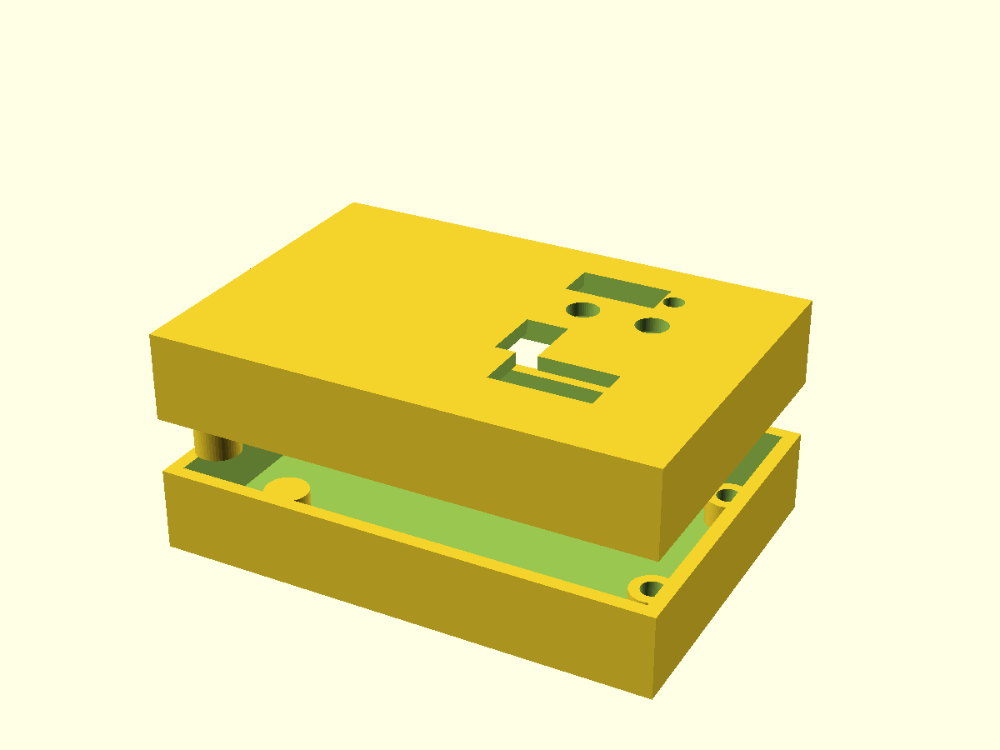

# 3D-printed enclosures

One OpenSCAD file, two enclosures (SMD and THT board). Each is **split horizontally at half height**: a bottom tray and a top frame with the cover plate.

| | SMD board | THT board |
|---|---|---|
| Assembled, outer | 72.3 × 49.8 × 24.6 mm | 94.3 × 49.8 × 24.6 mm |
| Bottom / top | 12.0 mm / 12.6 mm tall | same |
| STL | `bt2ps2-smd-unterteil.stl` (bottom), `bt2ps2-smd-oberteil.stl` (top) | `bt2ps2-tht-unterteil.stl`, `bt2ps2-tht-oberteil.stl` |



The box is larger than the board because the ESP32 module sticks out at both ends: the antenna (7 mm of air, no
copper and no screw underneath) and the D1 mini's USB socket (4.6 mm).

**How it holds together:** four M3 screws, all from below. They pass through the bottom tray into columns that hang
down from the top cover. **Two of them go through the board's mounting holes** — the board sits on a 4 mm post of
the bottom part and the column of the top part presses on it, so board and case share the same screw. The other two
stand in the free strip left of the board. Screw heads sit in countersinks, so the case stands flat.

**Openings in the top part:** two buttons (⌀4.6 mm), LED (⌀3.0 mm SMD board, ⌀3.6 mm THT board), the JST connector J1 (the
cable leaves through it), the 5 V jumper JP1, and the programming header J3. **USB** is a cutout in the side wall
at socket height.

**You need:** tactile switches **6 × 6 mm with a long plunger, 17 mm overall** ("6x6x17") — then the plunger ends
flush with the cover; and four M3 × 16 self-tapping screws (2.5 mm pilot holes); M3 × 12 works too.

**Rebuild or modify** — wall thickness, inner height, clearances and every cutout are parameters at the top of
[`bt2ps2-gehaeuse.scad`](bt2ps2-gehaeuse.scad):

```bash
openscad -D 'variante="smd"' -D 'teil="unterteil"' -o bt2ps2-smd-unterteil.stl bt2ps2-gehaeuse.scad
```

`variante` is `smd` or `tht`, `teil` is `unterteil` (bottom), `oberteil` (top) or `beides` (both, for viewing only).
Print the top part upside down — the columns then point upwards and need no supports.

> ⚠️ **Untested like the boards:** dimensions are taken from the KiCad files, but nothing has been printed or
> fitted yet. Print a test corner with one screw post and one button hole first.
